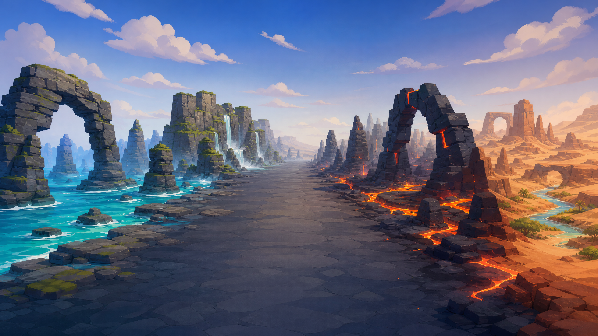

# STAR FOX — SKYBLAZER SQUADRON

**STAR FOX — SKYBLAZER SQUADRON** は、ブラウザだけで動作する Three.js 製の3Dレールシューティングです。プレイヤーは戦闘機を操縦し、独立AIの僚機とともに、海・峡谷・火山・砂漠を横断するWave形式のキャンペーンを戦います。プロシージャル地形、3D敵機、地上防空施設、ボス戦、分岐ルート、ローカルランキング、WebAudioによるBGM・効果音を備えています。



> **ローカル実行向けのゲームプロジェクトです。** ビルド工程は不要で、Node.jsの静的配信サーバーだけで起動できます。

## 主な特徴

| 領域 | 内容 |
|---|---|
| 戦闘 | 通常射撃、チャージ／ロックオン、スマートボム、バレルロール、ブースト、ブレーキ、弱点を持つボス戦。 |
| 僚機 | VEGA、NOVA、KITが独自の飛行・交戦AIで支援し、敵に狙われると救援対象になる。 |
| 敵 | 空中ドローン、戦闘機、CC0航空機素材を統合したSky Talon、地上砲台、戦車、水上艦、ボスを収録。 |
| 対空基地 | **Aegis AA Interceptor Base** がユーザー機と僚機を追尾し、発光センサーと回転レーダーで攻撃予兆を示す。 |
| 景観 | Azure Sea、Cascade Gorge、Ember Canyon、Dune Seaの4ゾーンに、海食岩、滝、苔、玄武岩、溶岩、風食アーチ、遠景フォグを配置。 |
| 演出 | Waveバナー、無線会話、コンボ、ポートレートHUD、撃墜VFX、BGM、効果音、ローカルランキング。 |

## 動作要件と起動方法

**Node.js 18以降**と最新のデスクトップまたはモバイルブラウザを推奨します。依存関係は`package-lock.json`に固定されています。

```bash
# リポジトリ取得後
cd STAR_FOX
npm ci

# 静的ゲームサーバーを起動
node server.mjs
```

起動後、ブラウザで <http://127.0.0.1:8747> を開いてください。ポートを変える場合は、環境変数を設定します。

```bash
PORT=4173 node server.mjs
```

`file://`から`index.html`を直接開く方式は、ES Modulesおよびアセット読み込みのためサポートしていません。`server.mjs`または任意の静的HTTPサーバーを使用してください。

## 操作方法

| 操作 | キーボード | ポインタ／タッチ |
|---|---|---|
| 移動 | `WASD` または矢印キー | マウス移動またはタッチ操作 |
| 通常射撃 | `Space` | 左クリック／タップ長押し |
| チャージ／ロックオン | `C` | 右クリック長押し後に離す |
| バレルロール | `Q` / `E`、または `⌘ + ← / →` | 画面操作に対応 |
| ブースト／ブレーキ | `Shift` / `Ctrl` | 画面操作に対応 |
| スマートボム | `B` | 画面操作に対応 |
| ポーズ／ミュート | `P` / `M` | 画面UI |
| タイトルの決定 | `Enter` | クリック／タップ |

## キャンペーンとゾーン

| Wave | ゾーン | 主な景観・敵対要素 |
|---|---|---|
| 1–3 | Azure Sea | 青緑の海、海食岩、沿岸滝、海上敵、水際の対空基地。 |
| 4–6 | Cascade Gorge | 層状崖、滝、苔の岩棚、峡谷壁の対空基地。 |
| 7–9 | Ember Canyon | 暗い玄武岩、分岐する溶岩流、火山アーチ、地上防空基地、Sky Talon。 |
| 10–12 | Dune Sea | 風食メサ、乾いた水脈、石アーチ、砂漠の対空基地。 |
| 13–14 | Afterburner | Ember Canyonを舞台にした高難度の敵軍再侵攻。 |
| 15–16 | Rift Citadel | Dune Seaで展開する最終局面。 |

## プロジェクト構成

```text
STAR_FOX/
├── index.html                  # ゲーム画面とUI要素
├── css/                        # HUD・メニュー・モバイル向けスタイル
├── src/
│   ├── game/                   # Game本体、Waveスクリプト、ボス・進行管理
│   ├── entities/               # プレイヤー、僚機、敵、3D機体ファクトリー
│   ├── world/                  # 地形、空、景観プロップ、ゾーンパレット
│   ├── core/                   # 入力、音声、ユーティリティ、ランキング
│   └── ui/                     # HUD・画面UI
├── assets/
│   ├── audio/                  # BGM・効果音
│   ├── models/                 # GLB／glTF形式の機体・景観モデル
│   ├── textures/               # 地形・機体テクスチャ
│   ├── skyboxes/               # ゾーン背景
│   ├── particles/              # 爆発・発射・煙などのVFXアセット
│   ├── ui/                     # ポートレート・UIアセット
│   └── concept/                # アートディレクション資料
├── server.mjs                  # ローカル静的サーバーとランキングAPI
├── THIRD_PARTY_ASSETS.md       # 第三者アセットの出所・変換・ライセンス記録
└── V*_QA.md                    # 各改善の設計・回帰テスト記録
```

## アセットとライセンス

このリポジトリにはゲーム実行に必要な**画像、GLB／glTFモデル、テクスチャ、HDRI、BGM、効果音、UI、コンセプト資料**を含めています。画像・音声・3D素材の詳細な出所、変換手順、ライセンス根拠は`THIRD_PARTY_ASSETS.md`、`ASSET_SOURCES_V26.md`、`assets/CREDITS_ASSETPACK.txt`、`assets/textures/CREDITS.txt`を参照してください。

| 素材の種別 | 主な出所 | 記録先 |
|---|---|---|
| 環境テクスチャ・HDRI | Poly Haven（CC0） | `assets/textures/CREDITS.txt`、`assets/CREDITS_ASSETPACK.txt` |
| パーティクル・宇宙施設モデル | Kenney（CC0） | `assets/CREDITS_ASSETPACK.txt` |
| 宇宙船モデル | Quaternius（CC0） | `assets/CREDITS_ASSETPACK.txt` |
| Sky Talon航空機 | iPoly3D／OpenGameArt（CC0）、GLB変換済み | `THIRD_PARTY_ASSETS.md` |
| 音声 | プロジェクト同梱アセットおよびコード生成音声 | `ASSET_SOURCES_V26.md`、`assets/audio/` |

配布元の生アーカイブ（`.zip`）およびUnity向けサンプルパッケージは、ゲーム実行時に参照されず、リポジトリ容量の肥大化を避けるためGit管理から除外しています。展開済みで実行に必要なアセットはすべて`assets/`以下に収録しています。

## 開発と検証

```bash
# ES Moduleの構文確認例
for f in src/*.js src/core/*.js src/entities/*.js src/game/*.js src/ui/*.js src/world/*.js; do
  cp "$f" "/tmp/check.mjs" && node --check /tmp/check.mjs
done
```

主要な変更では、各ゾーンの描画、中央飛行回廊、僚機標的選択、モバイル幅、アセット配信を回帰確認しています。直近の詳細は以下を参照してください。

| 記録 | 内容 |
|---|---|
| `V51_SKY_TALON_INTEGRATION_QA.md` | CC0航空機モデルの敵機統合。 |
| `V52_STAGE_LANDSCAPE_QA.md` | 4ゾーンの景観・水・地形・アーチ・遠景の統一。 |
| `V53_AA_INTERCEPTOR_BASE_QA.md` | 地対空迎撃基地、僚機標的、Wave配置、モバイル検証。 |

## 環境変数

`.env.example`は本番公開時に使用する`PUBLIC_ORIGIN`とローカルの`PORT`を示すテンプレートです。実際の`.env`はGit管理に含めないでください。

## 参照先

[Poly Haven](https://polyhaven.com) ・ [Kenney](https://kenney.nl) ・ [Quaternius](https://quaternius.com) ・ [OpenGameArt — Lowpoly light plane](https://opengameart.org/content/lowpoly-light-plane)
